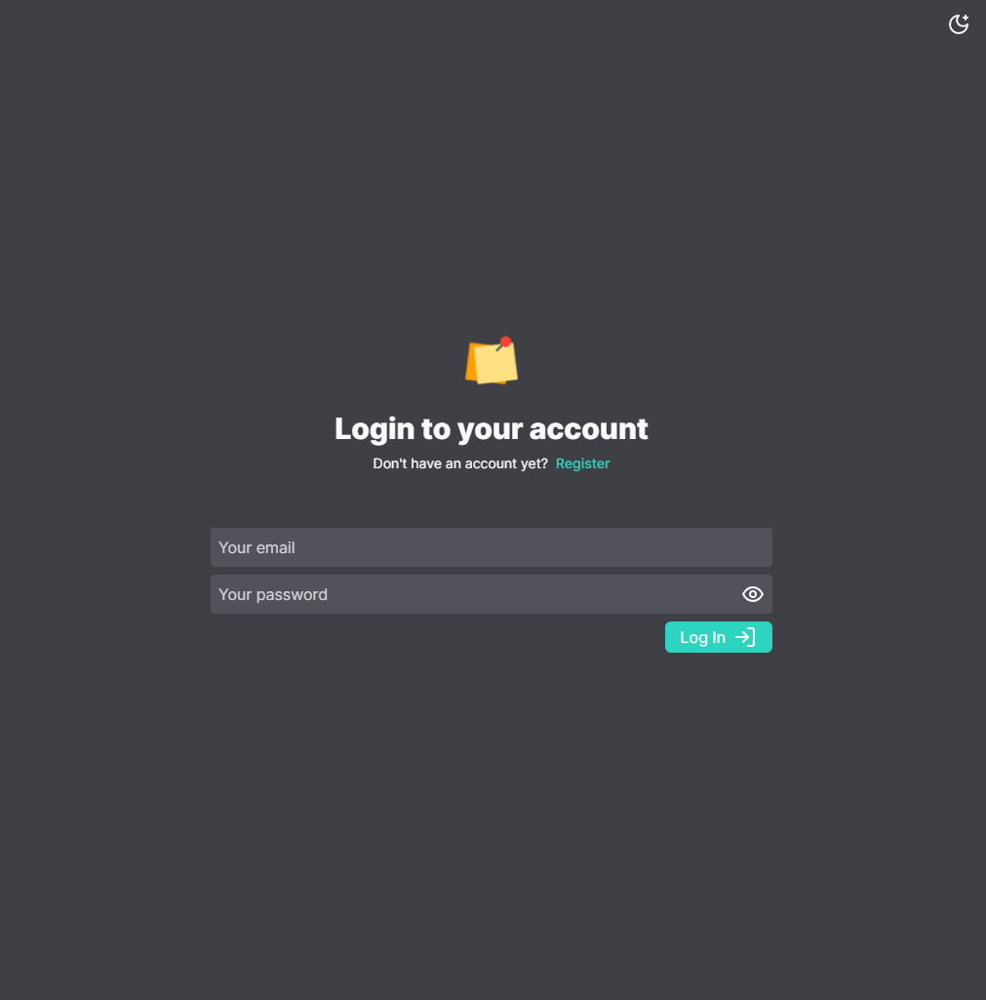
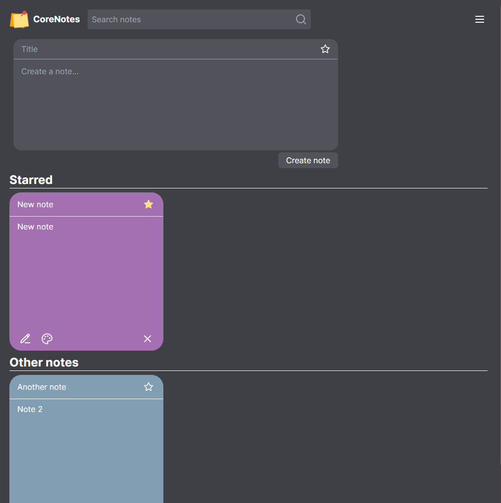
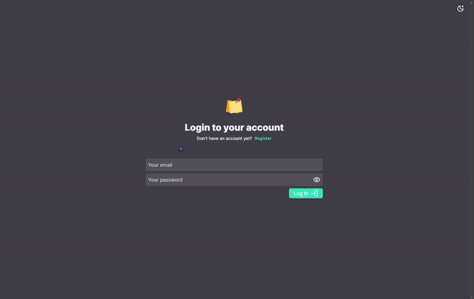

<a name="readme-top"></a>

[![Contributors][contributors-shield]][contributors-url]
[![Forks][forks-shield]][forks-url]
[![Stargazers][stars-shield]][stars-url]
[![Issues][issues-shield]][issues-url]
[![LinkedIn][linkedin-shield]][linkedin-url]

<br />
<div align="center">
  <a href="https://github.com/cassianojunior/corenotes-web">
    
  </a>

<h3 align="center">CoreNotes</h3>
  <p align="center">
    Project for a job opening at Corelab that consists a note management system
    <br />
    <a href="https://github.com/cassianojunior/corenotes-web"><strong>Explore the docs »</strong></a>
    <br />
    <br />
    <a href="https://github.com/cassianojunior/corenotes-web">View Demo</a>
    ·
    <a href="https://github.com/cassianojunior/corenotes-web/issues">Report Bug</a>
    ·
    <a href="https://github.com/cassianojunior/corenotes-web/issues">Request Feature</a>
  </p>
</div>

<details>
  <summary>Table of Contents</summary>
  <ol>
    <li>
      <a href="#about-the-project">About The Project</a>
      <ul>
        <li><a href="#built-with">Built With</a></li>
      </ul>
    </li>
    <li>
      <a href="#getting-started">Getting Started</a>
      <ul>
        <li><a href="#prerequisites">Prerequisites</a></li>
        <li><a href="#installation">Installation</a></li>
      </ul>
    </li>
    <li><a href="#roadmap">Roadmap</a></li>
    <li><a href="#contributing">Contributing</a></li>
    <li><a href="#license">License</a></li>
    <li><a href="#contact">Contact</a></li>
  </ol>
</details>

## About the Project

<div align="center">
  
  
  
</div>

<p align="right">(<a href="#readme-top">back to top</a>)</p>

### Built With

* [![Next][Next.js]][Next-url]
* [![React][React.js]][React-url]
* [![Tailwind][TailwindCSS]][TailwindCSS-url]
* [![React Hook Form][react-hook-form]][react-hook-form-url]
* [![Zod][zod]][zod-url]
* [![React Query][react-query]][react-query-url]
* [![Axios][axios]][axios-url]

<p align="right">(<a href="#readme-top">back to top</a>)</p>

## Getting Started

### Prerequisites

* CoreNotes API

  You can find and setup the API [here](https://github.com/cassianojunior/corenotes-api.git)

* Node

  You can install Node from [here](https://nodejs.org/en/download/)

### Installation

1. Clone the repo or download the zip file
  
    ```sh
    git clone https://github.com/cassianojunior/corenotes-web.git
    ```

2. Enter the project folder
  
    ```sh
    cd corenotes-web
    ```

3. Install NPM packages
  
    ```sh
    npm install
    ```

4. Run the project
  
    ```sh
      npm run dev
    ```

    Open [http://localhost:3000](http://localhost:3000) with your browser to see the result.

<p align="right">(<a href="#readme-top">back to top</a>)</p>

## Roadmap

* [x] Requested features
  * [x] Users should be able to create, read, update, and delete to-do items using the API.
  * [x]  Users should be able to mark an item as a favorite.
  * [x] Users should be able to set a color for each to-do item.
  * [x] The React frontend should display the user's to-do list in a responsive and visually appealing manner, with the ability to filter by favorite items and color.
  * [x] The favorited items should be displayed at the top of the list.
* [x] Additional features
  * [x] Users should be able to create an account and log in.
  * [x] Dark and light theme.

See the [open issues](https://github.com/cassianojunior/corenotes-web/issues) for a full list of proposed features (and known issues).

<p align="right">(<a href="#readme-top">back to top</a>)</p>

## Contributing

If you have a suggestion that would make this better, please fork the repo and create a pull request. You can also simply open an issue with the tag "enhancement".
Don't forget to give the project a star! Thanks again!

1. Fork the Project
2. Create your Feature Branch (`git checkout -b feature/AmazingFeature`)
3. Commit your Changes (`git commit -m 'Add some AmazingFeature'`)
4. Push to the Branch (`git push origin feature/AmazingFeature`)
5. Open a Pull Request

<p align="right">(<a href="#readme-top">back to top</a>)</p>

## Contact

Cassiano Junior - [@dev_cassianojr](https://twitter.com/dev_cassianojr) - [cassianojuniorww@gmail.com](mailto:cassianojuniorww@gmail.com)

Project Link: [https://github.com/cassianojunior/corenotes-web](https://github.com/cassianojunior/corenotes-web)

<p align="right">(<a href="#readme-top">back to top</a>)</p>

<!-- MARKDOWN LINKS & IMAGES -->
<!-- https://www.markdownguide.org/basic-syntax/#reference-style-links -->
[contributors-shield]: https://img.shields.io/github/contributors/cassianojunior/corenotes-web
[contributors-url]: https://github.com/cassianojunior/corenotes-web/graphs/contributors
[forks-shield]: https://img.shields.io/github/forks/cassianojunior/corenotes-web
[forks-url]: https://github.com/cassianojunior/corenotes-web/network/members
[stars-shield]: https://img.shields.io/github/stars/cassianojunior/corenotes-web
[stars-url]: https://github.com/cassianojunior/corenotes-web/stargazers
[issues-shield]: https://img.shields.io/github/issues/cassianojunior/corenotes-web
[issues-url]: https://github.com/cassianojunior/corenotes-web/issues
[linkedin-shield]: https://img.shields.io/badge/-LinkedIn-black.svg?logo=linkedin&colorB=555
[linkedin-url]: https://linkedin.com/in/cassianojunior
[Next.js]: https://img.shields.io/badge/Next-000000?logo=nextdotjs&logoColor=white
[Next-url]: https://nextjs.org/
[React.js]: https://img.shields.io/badge/React-20232A?logo=react&logoColor=61DAFB
[React-url]: https://reactjs.org/
[Tailwindcss]: https://img.shields.io/badge/TailwindCSS-0f172a?logo=tailwindcss&logoColor=06B6D4
[Tailwindcss-url]: https://tailwindcss.com/
[react-hook-form]: https://img.shields.io/badge/React_Hook_Form-081229?logo=reacthookform&logoColor=EC5990
[react-hook-form-url]: https://react-hook-form.com/
[zod]: https://img.shields.io/badge/Zod-283339?logo=zod&logoColor=3E67B1
[zod-url]:https://zod.dev
[react-query]: https://img.shields.io/badge/React_Query-111827?logo=reactquery&logoColor=FF4154
[react-query-url]: https://react-query.tanstack.com/
[axios]: https://img.shields.io/badge/Axios-373747?logo=axios&logoColor=5A29E4
[axios-url]: https://axios-http.com/
